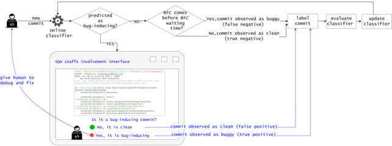

# HITL O-JIT-SDP

## Overview
replication kit for "Human-in-the-loop online just-in-time software defect prediction"
Online classifiers are built and evaluated by our extension of MOA framework  [moa-extension](https://github.com/liu906/moa-extension)  
Data analysis is conducted through R scripts.  

## Dependencies
openjdk version "1.8.0_362"
R-4.2.1  